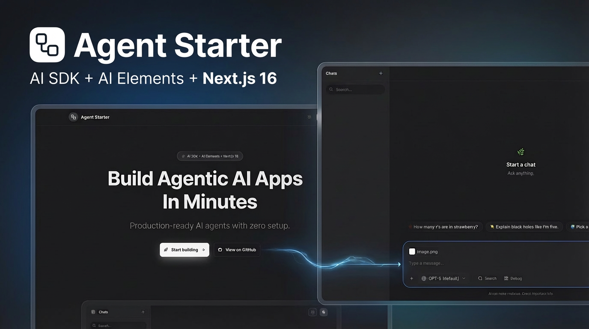
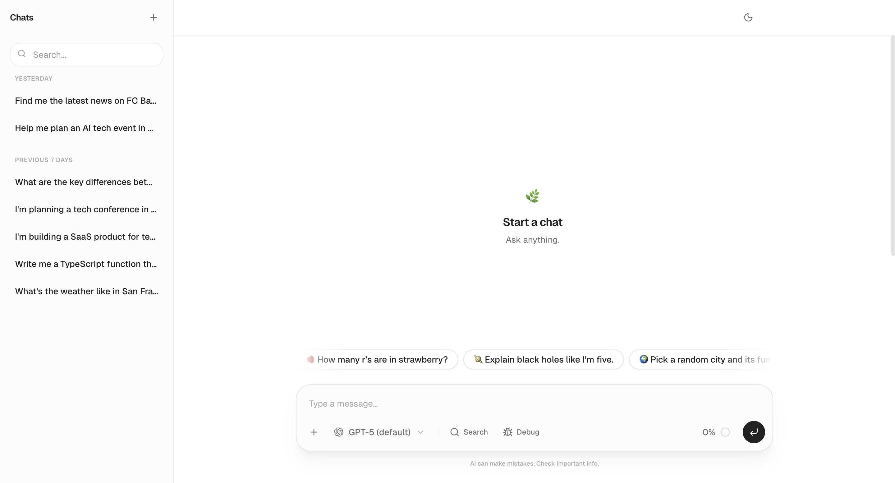
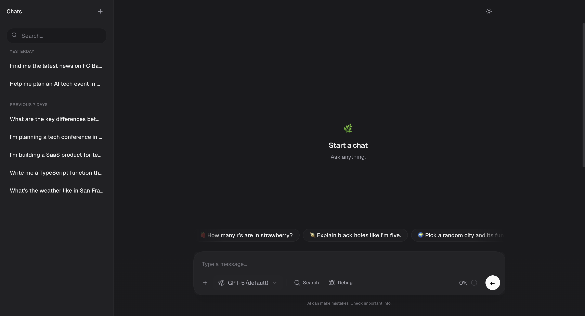
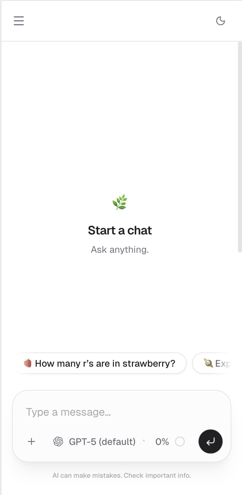

<div align="center">

<!-- Add hero image here: .github/images/hero.png -->


# 🤖 Agent Starter

**Production-ready AI chat interface with tool calling, streaming, and multi-provider support**

Built with [Vercel AI SDK](https://ai-sdk.dev) · [AI Elements](https://ai-sdk.dev/elements) · [Next.js 15](https://nextjs.org) · [TypeScript](https://typescriptlang.org)

[](https://www.typescriptlang.org/)
[](https://nextjs.org/)
[](https://ai-sdk.dev)
[](LICENSE)

[Website](https://agentstarter.fyi) · [Features](#-features) · [Quick Start](#-quick-start) · [Documentation](#-documentation) · [Examples](#-examples)

</div>

---

## 🎯 Overview

A polished, production-ready starter template for building AI agents with conversational interfaces. Features streaming responses, multi-step tool calling, web search with citations, and support for multiple AI providers.

Perfect for building:
- **AI assistants** with custom tools and knowledge
- **Research agents** with web search and citations
- **Data analysis tools** with database integration
- **Customer support bots** with contextual awareness
- **Internal tools** with API integrations

## ✨ Features

### 🎨 **Chat Experience**

<table>
<tr>
<td width="50%">

**Real-time Streaming**
- Server-sent events for instant responses
- Token-by-token streaming display
- Progress indicators and loading states

**Smart History**
- Sidebar with time-based grouping
- Search across conversations
- Draft mode (no empty chats)

</td>
<td width="50%">

**Advanced Interactions**
- Multi-step tool calling
- File attachments (drag & drop)
- Inline citations with `[1]`, `[2]` markers
- Chain-of-thought visualization
- Message branching & regeneration

</td>
</tr>
</table>

### 🤖 **Model Support**

| Provider | Models | Features |
|----------|--------|----------|
| **OpenAI** | GPT-5, GPT-4o, o4-mini | Reasoning, tools, web search |
| **Groq** | DeepSeek R1 (70B) | Fast inference, <think> reasoning |
| **AI Gateway** | All providers | Unified routing, cost optimization |

- **Runtime switching** - Change models mid-conversation
- **Reasoning display** - Collapsible thought process for o-series models
- **Token tracking** - Monitor input/output usage

### 🛠️ **Built-in Tools**

```typescript
// Example: Weather tool
const weather = await getWeather({ city: "San Francisco" });
// → { temp: 72, conditions: "Sunny" }
```

- ⏰ **getTime** - Current server time
- 🌤️ **getWeather** - Mock weather data (template for real APIs)
- 📎 **summarizeAttachments** - File content analysis
- 🔍 **web_search** - OpenAI built-in search (optional toggle)

→ See [`src/lib/ai/tools/examples/`](src/lib/ai/tools/examples/) for API, database, and search templates

### 🎨 **UI/UX**

<table>
<tr>
<td align="center" width="33%">

<!-- Screenshot 1: Light mode -->
<br/>
**Light Mode**

</td>
<td align="center" width="33%">

<!-- Screenshot 2: Dark mode -->
<br/>
**Dark Mode**

</td>
<td align="center" width="33%">

<!-- Screenshot 3: Mobile -->
<br/>
**Mobile Responsive**

</td>
</tr>
</table>

- 🎨 **Theme toggle** - Light/dark mode with `next-themes`
- 📱 **Mobile responsive** - Works on all screen sizes
- ⌨️ **Keyboard shortcuts** - `Cmd+K` new chat, `Cmd+Enter` send
- ♿ **Accessible** - ARIA labels, keyboard navigation

### 🏗️ **Developer Experience**

- ✅ **TypeScript strict mode** - Full type safety
- 🔧 **ESLint + Prettier** - Code quality enforcement
- 🔥 **Hot reload** - Instant feedback during development
- 📚 **Comprehensive docs** - Architecture, deployment, contributing guides
- 🧩 **Modular design** - Easy to extend and customize

---

## 🚀 Quick Start

### Prerequisites

- Node.js 18+ ([Download](https://nodejs.org/))
- pnpm (`npm install -g pnpm`)
- OpenAI API key ([Get one here](https://platform.openai.com/api-keys))

### Installation

```bash
# Clone the repository
git clone https://github.com/thorchh/agent-starter.git
cd agent-starter

# Install dependencies
pnpm install

# Set up environment variables
cp .env.example .env.local
# Edit .env.local and add your OPENAI_API_KEY

# Start the development server
pnpm dev
```

Open [http://localhost:3000](http://localhost:3000) to see your app! 🎉

### First Steps

1. **Try the chat** - Navigate to `/chat` and ask "What time is it?"
2. **Test tool calling** - The AI will call the `getTime` tool
3. **Enable search** - Toggle web search and ask "Latest news about AI"
4. **Customize** - Edit `src/lib/ai/system-prompt.ts` to change behavior

---

## 🎓 Examples

### Adding a Custom Tool

```typescript
// src/lib/ai/tools/getStockPrice.ts
import { tool } from "ai";
import { z } from "zod";

export const getStockPrice = tool({
  description: "Get the current stock price for a symbol",
  parameters: z.object({
    symbol: z.string().describe("Stock ticker symbol (e.g., AAPL)"),
  }),
  execute: async ({ symbol }) => {
    // Replace with real API call
    const price = Math.random() * 1000;
    return {
      symbol,
      price: price.toFixed(2),
      currency: "USD",
    };
  },
});

// src/lib/ai/tools/index.ts
export const tools = {
  getTime,
  getWeather,
  getStockPrice, // ← Add your tool
};
```

### Switching Providers

```typescript
// Use Groq for faster inference
AI_MODEL=groq/deepseek-r1-distill-llama-70b

// Use AI Gateway for cost optimization
AI_MODEL=gateway/openai/gpt-5
AI_GATEWAY_API_KEY=vck-...
```

### Enabling Reasoning (o-series models)

```typescript
// .env.local
ENABLE_REASONING=true
OPENAI_REASONING_SUMMARY=detailed
OPENAI_REASONING_EFFORT=high
```

---

## 📁 Project Structure

```
agent/
├── src/
│   ├── app/
│   │   ├── api/chat/           # Streaming chat endpoint
│   │   ├── chat/[id]/          # Chat page (dynamic route)
│   │   └── page.tsx            # Landing page
│   ├── components/
│   │   ├── chat/               # Chat UI (Client, Sidebar, MessageParts)
│   │   ├── ai-elements/        # AI Elements components
│   │   └── ui/                 # shadcn/ui primitives
│   └── lib/
│       ├── ai/
│       │   ├── provider.ts     # Multi-provider routing
│       │   ├── models.ts       # Model allowlist & config
│       │   ├── tools/          # Tool registry
│       │   └── system-prompt.ts
│       └── chat/
│           ├── server/         # File-based chat store
│           └── store/          # Store implementations
├── .env.example
├── ARCHITECTURE.md             # System design deep dive
├── DEPLOYMENT.md               # Production deployment guide
└── CONTRIBUTING.md             # Development guidelines
```

---

## 🔧 Environment Variables

| Variable | Required | Description | Default |
|----------|----------|-------------|---------|
| `OPENAI_API_KEY` | ✅ | OpenAI API key | - |
| `GROQ_API_KEY` | ❌ | Groq API key for DeepSeek R1 | - |
| `AI_GATEWAY_API_KEY` | ❌ | Vercel AI Gateway key | - |
| `AI_MODEL` | ❌ | Default model ID | `openai/gpt-5` |
| `ENABLE_REASONING` | ❌ | Show reasoning for o-series models | `false` |
| `OPENAI_REASONING_SUMMARY` | ❌ | Reasoning detail level | `auto` |
| `OPENAI_REASONING_EFFORT` | ❌ | Reasoning effort | `high` |

See [`.env.example`](.env.example) for full configuration.

---

## 📖 Documentation

| Document | Description |
|----------|-------------|
| [**ARCHITECTURE.md**](ARCHITECTURE.md) | System design, data flow, and key decisions |
| [**DEPLOYMENT.md**](DEPLOYMENT.md) | Production deployment with Vercel/Supabase |
| [**CONTRIBUTING.md**](CONTRIBUTING.md) | Development setup and guidelines |
| [**Tool Examples**](src/lib/ai/tools/examples/README.md) | Database, API, and search tool templates |

---

## 🚢 Deployment

### Quick Deploy to Vercel

[](https://vercel.com/new/clone?repository-url=https://github.com/thorchh/agent-starter)

### Production Checklist

For production use, you'll need to upgrade from the file-based storage:

- [ ] **Database** - Set up Vercel Postgres or Supabase (see [DEPLOYMENT.md](DEPLOYMENT.md))
- [ ] **Blob Storage** - Configure S3/R2/Vercel Blob for file attachments
- [ ] **Authentication** - Add NextAuth, Clerk, or Supabase Auth
- [ ] **Rate Limiting** - Implement per-user/IP rate limits
- [ ] **Monitoring** - Set up Sentry, Vercel Analytics, or similar

See [DEPLOYMENT.md](DEPLOYMENT.md) for detailed instructions.

---

## 🛠️ Tech Stack

| Category | Technologies |
|----------|-------------|
| **Framework** | Next.js 16 (App Router), React 19 |
| **Language** | TypeScript 5 (strict mode) |
| **AI** | Vercel AI SDK 6.0, AI Elements |
| **UI** | Tailwind CSS 4, shadcn/ui, Radix UI |
| **Providers** | OpenAI, Groq, AI Gateway |
| **Dev Tools** | ESLint, pnpm, Hot Reload |

---

## 🤝 Contributing

Contributions are welcome! Please see [CONTRIBUTING.md](CONTRIBUTING.md) for:

- Development setup
- Code style guidelines
- Testing requirements
- Pull request process

---

## 📝 License

This is a starter template. Use it however you like - MIT License.

---

## 🙏 Acknowledgments

Built with:
- [Vercel AI SDK](https://ai-sdk.dev) - AI framework
- [AI Elements](https://ai-sdk.dev/elements) - Pre-built UI components
- [shadcn/ui](https://ui.shadcn.com) - UI component library
- [Next.js](https://nextjs.org) - React framework

---

<div align="center">

**[⭐ Star this repo](https://github.com/thorchh/agent-starter)** if you find it useful!

[Website](https://agentstarter.fyi) · [Documentation](https://agentstarter.fyi/docs) · [GitHub](https://github.com/thorchh/agent-starter)

Made with ❤️ for the AI community

</div>
